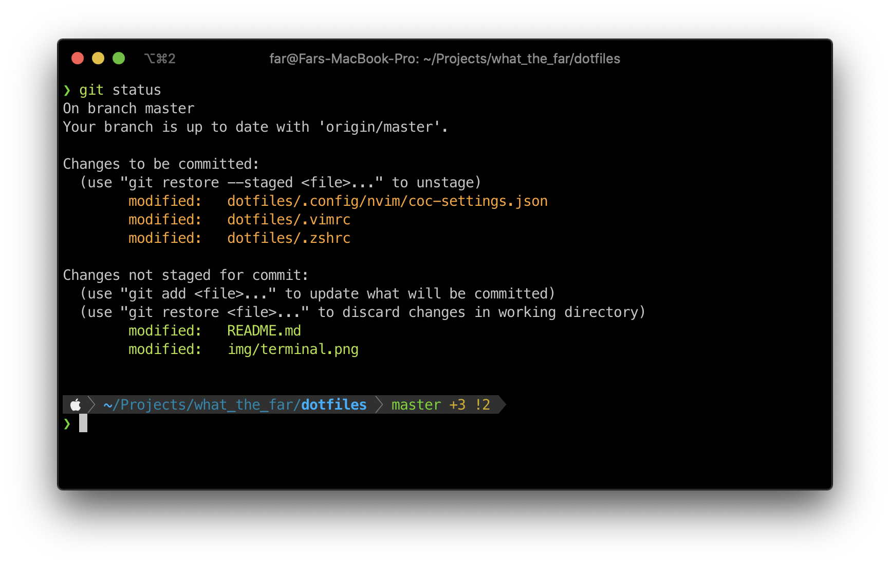
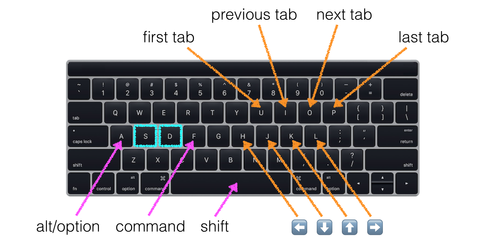
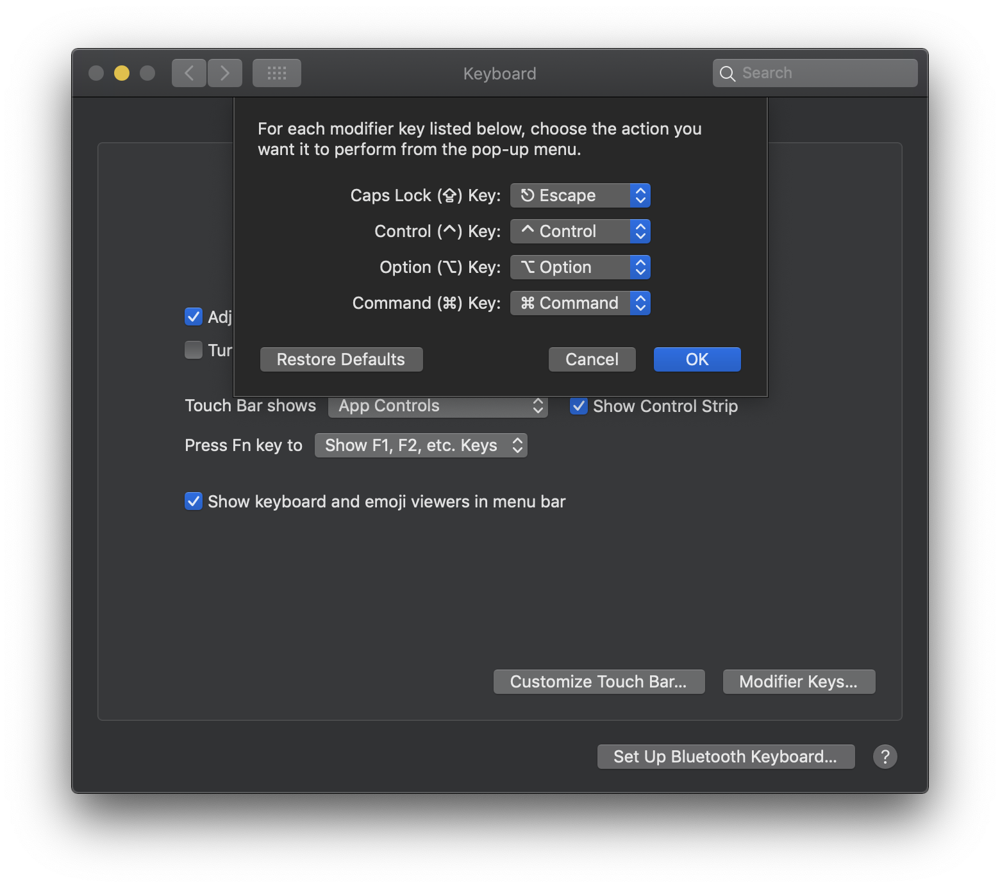
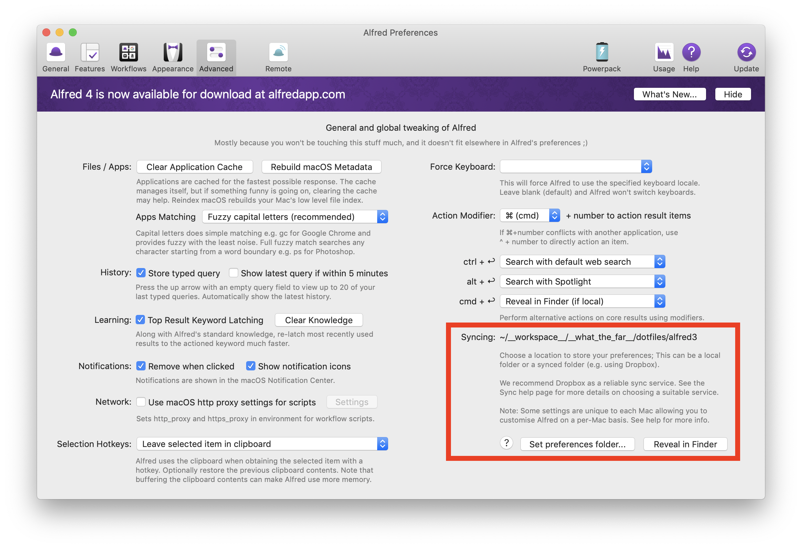

# WhatTheFar’s dotfiles



> This setup is heavily inspired from [Mathias’s dotfiles](https://github.com/mathiasbynens/dotfiles)

## Features

- [Access <kbd>control</kbd> and <kbd>escape</kbd> on the home row](#supercharge-caps-lock-key)
- [Navigate (up/down/left/right) via the home row](#super-duper-mode)
- [Navigate to previous/next word via the home row](#super-duper-mode)
- [Launch commonly-used apps via global keyboard shortcuts](#hyper-key-for-quickly-launching-apps)

### Supercharge <kbd>caps lock</kbd> key

By repurposing the anachronistic <kbd>caps lock</kbd> key, we can make <kbd>control</kbd> and <kbd>escape</kbd> accessible via the home row.

- Tap <kbd>caps lock</kbd> for <kbd>escape</kbd>
- Hold <kbd>caps lock</kbd> for <kbd>control</kbd>

Say goodbye to [Emacs pinky](http://wiki.c2.com/?EmacsPinky). 👋

### (S)uper (D)uper Mode

To activate, push the <kbd>s</kbd> and <kbd>d</kbd> keys simultaneously and hold them down. Now you're in (S)uper (D)uper Mode. It's like a secret keyboard _inside_ your keyboard. (Whoa.) It's optimized for keeping you on the home row, or very close to it. Now you can:

- Use <kbd>h</kbd> / <kbd>j</kbd> / <kbd>k</kbd> / <kbd>l</kbd> for **left**/**down**/**up**/**right** respectively
- Use <kbd>a</kbd> for <kbd>option</kbd> (AKA <kbd>alt</kbd>)
- Use <kbd>f</kbd> for <kbd>command</kbd>
- Use <kbd>space</kbd> for <kbd>shift</kbd>
- Use <kbd>a</kbd> + <kbd>j</kbd> / <kbd>k</kbd> for <kbd>page down</kbd> / <kbd>page up</kbd>
- Use <kbd>i</kbd> / <kbd>o</kbd> to move to the previous/next tab
- Use <kbd>u</kbd> / <kbd>p</kbd> to go to the first/last tab (in most apps)
- Use <kbd>a</kbd> + <kbd>h</kbd> / <kbd>l</kbd> to move to previous/next word (in most apps)

[](img/super-duper-mode.png)

📣 Shout-out to [Karabiner's Simultaneous vi Mode](https://github.com/tekezo/Karabiner/blob/05ca98733f3e3501e0679814c3795d1cb57e177f/src/core/server/Resources/include/checkbox/simultaneouskeypresses_vi_mode.xml#L4-L10) for providing the inspiration for (S)uper (D)uper Mode. ⌨:neckbeard:✨

### Hyper key for quickly launching apps

macOS doesn't have a native <kbd>hyper</kbd> key.
But thanks to Karabiner-Elements, we can [create our own](src/.config/karabiner/assets/complex_modifications/hyper.json).
In this setup, we'll use the <kbd>right option</kbd> key as our <kbd>hyper</kbd> key.

With a new modifier key defined, we open a whole world of possibilities.
I find it especially useful for providing global shortcuts for launching apps.

#### Default app keybindings

- <kbd>hyper</kbd> + <kbd>b</kbd> to open Google Chrome ("B" for "Browser")
- <kbd>hyper</kbd> + <kbd>c</kbd> to open LINE ("C for "Chat")
- <kbd>hyper</kbd> + <kbd>d</kbd> to open [Discord](https://discord.com/) ("D" for "Discord")
- <kbd>hyper</kbd> + <kbd>e</kbd> to open [Visual Studio Code](https://code.visualstudio.com/) ("E" for "Editor")
- <kbd>hyper</kbd> + <kbd>f</kbd> to open [Fork](https://git-fork.com/) ("F" for "Fork")
- <kbd>hyper</kbd> + <kbd>m</kbd> to open [Spotify](https://www.spotify.com/) ("M" for "Music")
- <kbd>hyper</kbd> + <kbd>s</kbd> to open [Slack](https://slack.com/downloads/osx) ("S" for "Slack")
- <kbd>hyper</kbd> + <kbd>t</kbd> to open [iTerm2](https://www.iterm2.com/) ("T" for "Terminal")

## Prerequisite

- Set Apple ID for App Store
- Run the following codes to:
  - Install Homebrew
  - Install oh-my-zsh

```bash
# install Homebrew
/bin/bash -c "$(curl -fsSL https://raw.githubusercontent.com/Homebrew/install/HEAD/install.sh)"

# install oh-my-zsh
sh -c "$(curl -fsSL https://raw.githubusercontent.com/robbyrussell/oh-my-zsh/master/tools/install.sh)"
```

## Bootstrapping

```bash
./bootstrap.sh
```

## Manual Setups

### Keyboard

#### Remap CAPS LOCK to ESCAPE

Go to `System Preferences -> Keyboard -> Modifier Keys...` and set Caps Lock Key to `Escape`



### Accessibility

#### Zoom

Go to `System Preferences -> Accessibility -> Zoom`

- Use scroll gesture with modifier keys to zoom -> `^ Control`
- Zoom follows the keyboard focus

#### Three finger dragging

Go to `System Preferences -> Accessibility -> Mouse & Trackpad -> Trackpad Options...`

- Enable dragging -> `three finger drag`

### Alfred

In advanced setting page, set preferences folder to `alfred3`.



## References

[Mathias’s dotfiles](https://github.com/mathiasbynens/dotfiles)

[Toward a more useful keyboard](https://github.com/jasonrudolph/keyboard)

## License

    Copyright 2019 Jakpat Mingmongkolmitr

    Licensed under the Apache License, Version 2.0 (the "License");
    you may not use this file except in compliance with the License.
    You may obtain a copy of the License at

       http://www.apache.org/licenses/LICENSE-2.0

    Unless required by applicable law or agreed to in writing, software
    distributed under the License is distributed on an "AS IS" BASIS,
    WITHOUT WARRANTIES OR CONDITIONS OF ANY KIND, either express or implied.
    See the License for the specific language governing permissions and
    limitations under the License.
