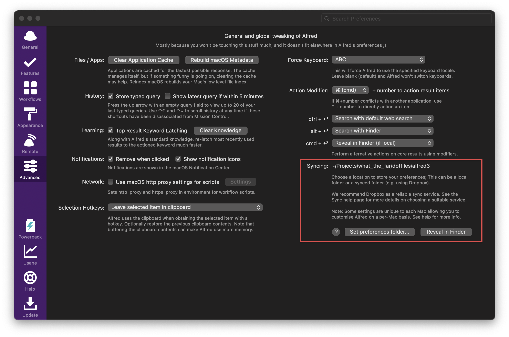

# WhatTheFar’s dotfiles

> This setup is heavily inspired from [Mathias’s dotfiles](https://github.com/mathiasbynens/dotfiles)

## Manual Setups

### Keyboard

#### Remap CAPS LOCK to ESCAPE

Go to `System Preferences -> Keyboard -> Modifier Keys...` and set Caps Lock Key to `Escape`

### Alfred

In advanced setting page, set preferences folder to `alfred3`.

## References

[Bash scripting cheatsheet](https://devhints.io/bash)

[Mathias’s dotfiles](https://github.com/mathiasbynens/dotfiles)

## License

    Copyright 2019 Jakpat Mingmongkolmitr

    Licensed under the Apache License, Version 2.0 (the "License");
    you may not use this file except in compliance with the License.
    You may obtain a copy of the License at

       http://www.apache.org/licenses/LICENSE-2.0

    Unless required by applicable law or agreed to in writing, software
    distributed under the License is distributed on an "AS IS" BASIS,
    WITHOUT WARRANTIES OR CONDITIONS OF ANY KIND, either express or implied.
    See the License for the specific language governing permissions and
    limitations under the License.
